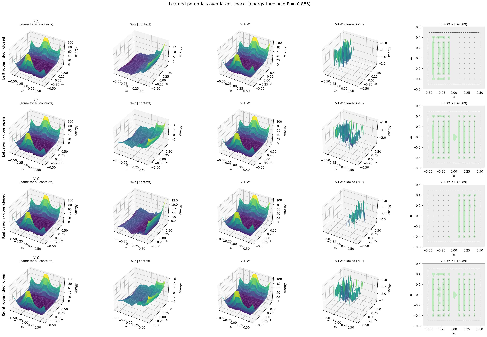
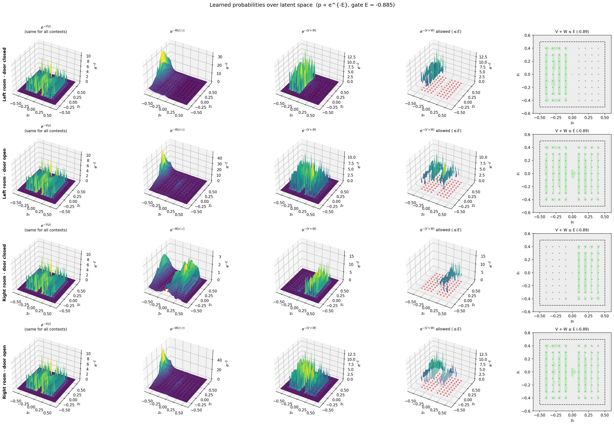
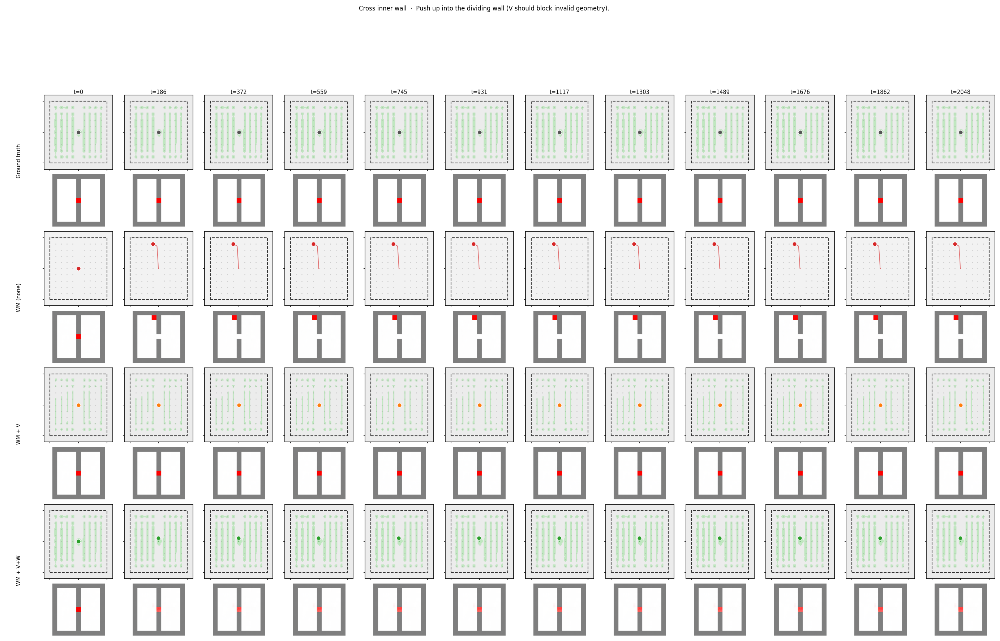
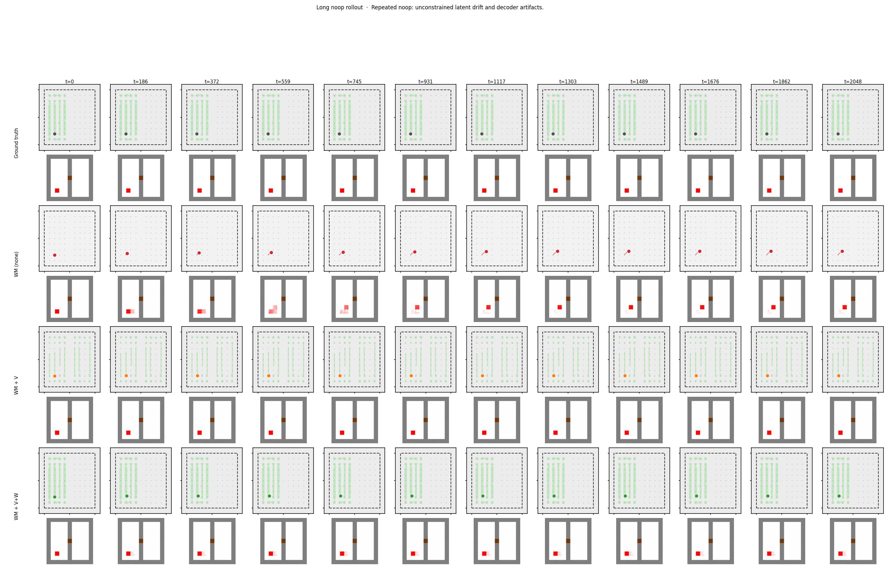
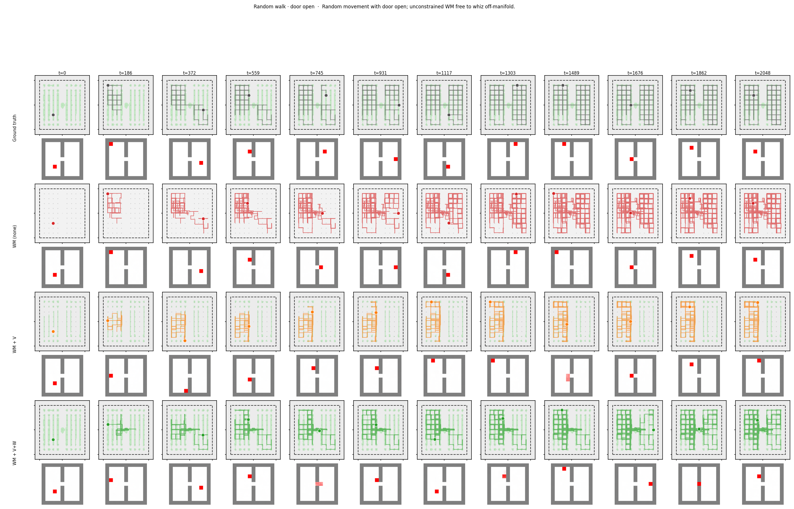

# DPWM: Dual Potential World Model

DPWM is an experimental world model architecture designed to reduce long-rollout drift by constraining predicted states with learned latent-space potentials.

This project was started as a response to a problem I encountered while building my first action-conditioned world model, **PRISM**. PRISM predicted future Minecraft frames from images and actions, but during test-time rollouts the model quickly drifted. It entered impossible image states, or states that were visually plausible in isolation but inconsistent with what had actually happened in the world.

DPWM explores a different approach: instead of relying only on very long rollout training, it tries to learn **physical barriers in latent space** that prevent the model from entering invalid or context-inconsistent states.

## Core Idea

DPWM learns an image latent space and two energy-like potentials over that space:

* `V(z)`: a global potential over latent states.

  * It represents which states are possible in general, regardless of context.
* `W(z, c)`: a context-conditioned potential.

  * It represents which states are possible given the current context.
* `E`: a learned threshold.

  * A latent state is considered occupiable only when:

```text
V(z) + W(z, c) <= E
```

The goal is to make impossible states physically inaccessible to the world model, rather than only hoping the model learns to avoid them from rollout data.

## Architecture

The current DPWM prototype contains the following components:

1. **Image Encoder**

   Encodes an input image into a latent representation:

   ```text
   image -> z
   ```

2. **Context Model**

   Builds a context representation from previous transformative events in the environment.

   In the current prototype, the context model uses only the most recent transformative action. In future versions, this context model should become recurrent, taking the previous context embedding as input or using it as a residual update.

3. **World Model**

   Predicts the next latent state from the current latent, action, and context:

   ```text
   z_t, action_t, context_t -> z_{t+1}
   ```

4. **Decoder**

   Decodes the predicted latent state back into an image:

   ```text
   z_{t+1} -> predicted image
   ```

5. **Dual Potentials**
   The predicted latent state is constrained by the learned potentials:

    ```text
    V(z) + W(z, c) <= E
    ```
   This constraint is meant to prevent the model from occupying impossible or context-invalid states.

   
   

## Toy Environment

The first experiment uses a simple two-room environment.

The environment contains:

* a left room,
* a right room,
* a wall between them,
* a door connecting the two rooms.

The agent can only move from one room to the other by first going to the door and opening it.

Whenever an action changes the world in a meaningful way, it is added to a history of **transformative actions**. Each transformative snapshot stores:

* the image at that moment,
* the action that caused the transformation.

For now, the context model only uses the most recent succesful transformative action. This is a simplification of the longer-term goal, where context should accumulate over time.

## Motivation

Standard action-conditioned world models can learn locally plausible transitions while still failing over long rollouts. A prediction may look realistic as an image, but still violate the history or rules of the world.

For example, in the two-room environment, both rooms are valid states individually. A model may therefore predict that the agent moves from one room to the other, even when the door has not been opened. The predicted state is visually plausible, but contextually impossible.

DPWM tries to address this by separating two ideas:

```text
Is this state possible at all?
```

and:

```text
Is this state possible in the current context?
```

The global potential `V` handles the first question.
The context-conditioned potential `W` handles the second.

## Preliminary Results

In the toy two-room setup, the baseline world model learns many of the environment rules but can still tunnel through constraints during rollout. For example, it may predict transitions through the inner wall because both rooms are individually possible states.

With the `V` and `W` potential constraints in place, the model is prevented from occupying latent states that violate the learned energy threshold. This reduces impossible transitions and supports the idea that long-rollout drift can be addressed by learned latent-space barriers, rather than only by training on longer and longer rollouts.

These results are preliminary and currently demonstrated only in a toy environment.

**Trying to cross a wall:**


**Repeated no-op:**


**Random walk with door open:**


## Current Limitations

* The experiment is currently limited to a simple two-room environment.
* The context model only uses the most recent transformative action.

## Roadmap

Planned improvements include:

* implementing a recurrent context model,
* expanding beyond the two-room toy environment,

## Installation

```bash
pip install -r requirements.txt
```

## Training

The training pipeline is currently split into multiple stages. Run all commands from the repository root.

First, set the `PYTHONPATH` so Python can find the source code.

### Windows PowerShell

```powershell
$env:PYTHONPATH = "$PWD\src"
```

Then train the models in order:

### 1. Train the autoencoder

```powershell
python3 experiments\unlocked_door\train.py --stage ae
```

This trains the image encoder and decoder used to map images into latent space and reconstruct them.

### 2. Train the global potential `V`

```powershell
python3 experiments\unlocked_door\train.py --stage v
```

This trains the global potential model, which learns which latent states are possible in general.

### 3. Train the context model and context-conditioned potential `W`

```powershell
python3 experiments\unlocked_door\train.py --stage ctx_w
```

This trains the context-dependent part of the model, including the potential that restricts which states are possible given the current context.

### 4. Optional: fine-tune the decoder

If the decoded predictions need improvement, the decoder can be fine-tuned with:

```powershell
python3 experiments\unlocked_door\train.py --stage decoder
```

## Training Order Summary

```powershell
$env:PYTHONPATH = "$PWD\src"

python3 experiments\unlocked_door\train.py --stage ae
python3 experiments\unlocked_door\train.py --stage v
python3 experiments\unlocked_door\train.py --stage ctx_w

# Optional
python3 experiments\unlocked_door\train.py --stage decoder
```

## Notes

The current experiment is located in:

```text
experiments/unlocked_door/
```

The main training entry point is:

```text
experiments/unlocked_door/train.py
```

The repository currently requires `PYTHONPATH` to be set manually. A future improvement would be to package the project properly so training can be launched without manually setting `PYTHONPATH`.

## Project Status

This repository is a research prototype. The goal is to explore whether learned latent-space energy constraints can reduce world-model drift during long rollouts.

## Relationship to PRISM

DPWM was motivated by issues observed in PRISM, an earlier action-conditioned visual world model. PRISM showed that image prediction models can produce plausible-looking frames while drifting away from the actual state of the world during test-time rollouts.

DPWM is an attempt to make the latent dynamics more physically constrained by learning which states are globally possible and which states are possible under the current context.

## License

Add a license here.
